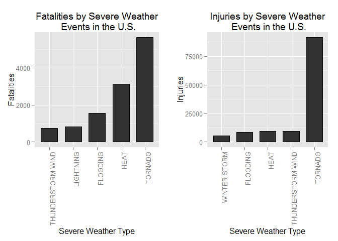
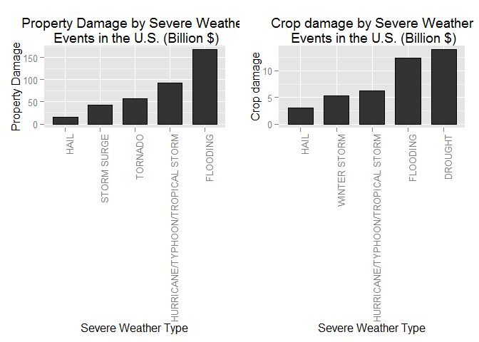

# NOAA's Storm Events Database:
 A Swiss knife in preparing for severe weather events


## Synopsis

In this report, we aim to analyze the impact of different weather events on public health and economy based on the storm database collected from the U.S. National Oceanic and Atmospheric Administration's (NOAA) from 1950 - 2011. We use the number of fatalities, injuries, property and crop damage to decide which types of event are most harmful to the population health and economy. From these data, we found that excessive heat and tornado are most harmful with respect to population health, while flood, drought, and hurricane/typhoon have the greatest economic consequences.

## Loading and preprocessing the raw data

Data for this assignment can be downloaded from:

* [Storm Data](https://d396qusza40orc.cloudfront.net/repdata%2Fdata%2FStormData.csv.bz2) [47Mb]
There is also some documentation of the database available. Here you will find how some of the variables are constructed/defined.

* National Weather Service [Storm Data Documentation](https://d396qusza40orc.cloudfront.net/repdata%2Fpeer2_doc%2Fpd01016005curr.pdf)

* National Climatic Data Center Storm Events [FAQ](https://d396qusza40orc.cloudfront.net/repdata%2Fpeer2_doc%2FNCDC%20Storm%20Events-FAQ%20Page.pdf)

### Reading the raw data

There are 902297 rows and 37 columns in total. The events in the database start in the year 1950 and end in November 2011. In the earlier years of the database there are generally fewer events recorded, most likely due to a lack of good records. More recent years should be considered more complete


```r
remove(list=ls())
sessionInfo()
```

```
## R version 3.1.2 (2014-10-31)
## Platform: x86_64-w64-mingw32/x64 (64-bit)
## 
## locale:
## [1] LC_COLLATE=Greek_Greece.1253  LC_CTYPE=Greek_Greece.1253   
## [3] LC_MONETARY=Greek_Greece.1253 LC_NUMERIC=C                 
## [5] LC_TIME=Greek_Greece.1253    
## 
## attached base packages:
## [1] stats     graphics  grDevices utils     datasets  methods   base     
## 
## loaded via a namespace (and not attached):
## [1] digest_0.6.8    evaluate_0.5.5  formatR_1.0     htmltools_0.2.6
## [5] knitr_1.9       rmarkdown_0.4.2 stringr_0.6.2   tools_3.1.2    
## [9] yaml_2.1.13
```

```r
# load r libraries
packages <- c("knitr", "dplyr", "tidyr",  "ggplot2", "gridExtra", "R.utils", "downloader", "lubridate")
if (length(setdiff(packages, rownames(installed.packages()))) > 0) {
  install.packages(setdiff(packages, rownames(installed.packages())))  
}
sapply(packages, require, character.only=TRUE, quietly=TRUE)
```

```
##      knitr      dplyr      tidyr    ggplot2  gridExtra    R.utils 
##       TRUE       TRUE       TRUE       TRUE       TRUE       TRUE 
## downloader  lubridate 
##       TRUE       TRUE
```

```r
downloadFile <-function(furl, fsave){
        download(furl, fsave = "wb")
        #download.file(fileUrl,  fsave, method="curl")
        cat(paste0("file download complete - remember to unzip file: ",fsave))        
}   

#DEBUG <- TRUE
fileUrl <- "https://d396qusza40orc.cloudfront.net/repdata%2Fdata%2FStormData.csv.bz2"
DATAFILE <- file.path(getwd(), "stormData.cvs")
DATAZIP  <- file.path(getwd(), "stormData.bz2")

# check and download data file
if (!file.exists(DATAFILE)) {
  cat(paste0(DATAFILE," doesn't exist"))
  # check data exists
        if (!file.exists(DATAZIP)) {
                cat(paste0(DATAZIP," doesn't exist trying to download ... "))
                downloadFile(fileUrl, DATAZIP)
                }
  # Extract file from bz2
  bunzip2(DATAZIP, DATAFILE, remove = FALSE)  
  stopifnot(file.exists(DATAFILE))          
}   
```


```r
assign( "rawData", read.csv(DATAFILE), envir = .GlobalEnv)
```

### Standardizing EVTYPEs

Data is rather messy. There are 985 factors of EVTYPE. So we need to clean the EVTYPE label.  We'll collapse the many variations of the most common event types into a single EVTYPE.  In general we do  `head(sort(table(rawData$EVTYPE), decreasing=TRUE), 30)`
and observe high frequency counts that could be combined, e.g. 
`table(grep(“THUNDERSTORM WIND”, rawData$EVTYPE, value=TRUE))`
We use the EVTYPE with highest frequency as the “standard” name.


```r
head(table(rawData$EVTYPE), n =20)
```

```
## 
##     HIGH SURF ADVISORY          COASTAL FLOOD            FLASH FLOOD 
##                      1                      1                      1 
##              LIGHTNING              TSTM WIND        TSTM WIND (G45) 
##                      1                      4                      1 
##             WATERSPOUT                   WIND                      ? 
##                      1                      1                      1 
##        ABNORMAL WARMTH         ABNORMALLY DRY         ABNORMALLY WET 
##                      4                      2                      1 
##   ACCUMULATED SNOWFALL    AGRICULTURAL FREEZE          APACHE COUNTY 
##                      4                      6                      1 
## ASTRONOMICAL HIGH TIDE  ASTRONOMICAL LOW TIDE               AVALANCE 
##                    103                    174                      1 
##              AVALANCHE           BEACH EROSIN 
##                    386                      1
```

```r
# Force all EVTYPEs to uppercase to avoid case variations
rawData$EVTYPE <- toupper(rawData$EVTYPE)

# Standardize spacing: replace multiple spaces with single space
rawData$EVTYPE <- gsub(" +", " ", rawData$EVTYPE)

rawData$EVTYPE[grep("HURRICANE|TYPHOON|TROPICAL", rawData$EVTYPE)] <- "HURRICANE/TYPHOON/TROPICAL STORM"

rawData$EVTYPE[grep("SNOW|ICE|BLIZZARD|WINTER STORM|FREEZING|WINTRY MIX|SLEET", rawData$EVTYPE)] <- "WINTER STORM"

rawData$EVTYPE[grep("WINTER WEATHER|COLD|ICY|GLAZE|LOW TEMPERATURE|HYPOTHERMIA|HYPERTHERMIA|COLD TEMPERATURE|WINDCHILL", 
    rawData$EVTYPE)] <- "WINTER WEATHER"

# ~15 variations of 'High Wind' and 3 variations of 'strong wind' but after
# 'Snow' variations removed above
rawData$EVTYPE[grep("HIGH WIND|STRONG WIND|Gusty Winds|GUSTY WIND", rawData$EVTYPE)] <- "HIGH WIND"

# Change these 'false hits' for 'thunderstorm wind' to wind
rawData$EVTYPE <- sub("NON-THUNDERSTORM WIND|NON THUNDERSTORM WIND", "WIND", rawData$EVTYPE)

# Other non thunderstorm winds

# Standardize variations/spelling errors in 'Thunderstorm'
rawData$EVTYPE <- gsub("THUNDEERSTORM|THUNDERESTORM|THUNDERSTROM|THUDERSTORM|THUNERSTORM|THUNDERTORM|TUNDERSTORM", 
    "THUNDERSTORM", rawData$EVTYPE)

rawData$EVTYPE <- sub("TSTM WIND|STORM FORCE WINDS", "THUNDERSTORM WIND", rawData$EVTYPE)
# Manually reviewed ~44 variations that are combined here
rawData$EVTYPE[grep("THUNDERSTORMW|THUNDERSTORMWINDS|THUNDERSTORM WINS|TSTMW", rawData$EVTYPE)] <- "THUNDERSTORM WIND"
rawData$EVTYPE[grep("THUNDERSTORM WIND|THUNDERSTORMS WIND", rawData$EVTYPE)] <- "THUNDERSTORM WIND"

# Combine ~59 variations of FLOODING
rawData$EVTYPE[grep("FLOOD|FLD|RECORD RAINFALL", rawData$EVTYPE)] <- "FLOODING"

# Combine ~20 variations of HAIL
rawData$EVTYPE[grep("HAIL", rawData$EVTYPE)] <- "HAIL"

# Combine variations of LIGHTNING
rawData$EVTYPE[grep("LIGHTNING|LIGHTING|LIGNTNING", rawData$EVTYPE)] <- "LIGHTNING"

# Combine variations of fire
rawData$EVTYPE[grep("HEAVY SURF|HIGH SURF", rawData$EVTYPE)] <- "HEAVY/HIGH SURF"

# Combine variations of fire
rawData$EVTYPE[grep("FIRE", rawData$EVTYPE)] <- "WILDFIRE"

# Combine variations of freeze -- likely agriculture related
rawData$EVTYPE[grep("FROST|FREEZE", rawData$EVTYPE)] <- "FROST/FREEZE"

rawData$EVTYPE[grep("SLIDE", rawData$EVTYPE)] <- "LAND/MUD/ROCK SLIDES"

rawData$EVTYPE[grep("RIP", rawData$EVTYPE)] <- "RIP CURRENT"

# HEAT or EXCESSIVE HEAT
rawData$EVTYPE[grep("HEAT", rawData$EVTYPE)] <- "HEAT"

rawData$EVTYPE[grep("DENSE FOG", rawData$EVTYPE)] <- "FOG"

# Only notable winds are high wind
rawData$EVTYPE[rawData$EVTYPE == "WINDS" | rawData$EVTYPE == "WIND"] <- "HIGH WIND"


# Collapse all events with frequency < 50 to category “mis”:

event.types <- sort(table(rawData$EVTYPE), decreasing = TRUE)
event.types.under.50 <- names(event.types[event.types < 50])

rawData$EVTYPE[rawData$EVTYPE %in% event.types.under.50] <- "MISC"
```

Thus the list of EVTYPEs for the analysis:

```r
sort(table(rawData$EVTYPE), decreasing = TRUE)
```

```
## 
##                THUNDERSTORM WIND                             HAIL 
##                           336725                           289281 
##                         FLOODING                          TORNADO 
##                            86115                            60652 
##                     WINTER STORM                        HIGH WIND 
##                            34535                            26216 
##                        LIGHTNING                       HEAVY RAIN 
##                            15769                            11742 
##                   WINTER WEATHER                     FUNNEL CLOUD 
##                            10924                             6844 
##                         WILDFIRE                       WATERSPOUT 
##                             4239                             3796 
##                             HEAT                          DROUGHT 
##                             2648                             2488 
##                              FOG                     FROST/FREEZE 
##                             1834                             1503 
##                             MISC                  HEAVY/HIGH SURF 
##                             1141                             1060 
## HURRICANE/TYPHOON/TROPICAL STORM                      RIP CURRENT 
##                             1056                              774 
##             LAND/MUD/ROCK SLIDES                       DUST STORM 
##                              646                              427 
##                        AVALANCHE                      STORM SURGE 
##                              386                              261 
##                   DRY MICROBURST            ASTRONOMICAL LOW TIDE 
##                              186                              174 
##                    RECORD WARMTH                       DUST DEVIL 
##                              154                              149 
##                 STORM SURGE/TIDE                UNSEASONABLY WARM 
##                              148                              126 
##           ASTRONOMICAL HIGH TIDE                    FUNNEL CLOUDS 
##                              103                               87 
##                 UNSEASONABLY DRY                            OTHER 
##                               56                               52
```

We keep only the records that show fatalities, injuries, property or crop damage.


```r
stormData <- tbl_df(rawData) %>%
        filter(FATALITIES >0 | INJURIES >0 | PROPDMG >0| CROPDMG >0) %>%
        mutate (BGN_DATE  = mdy_hms(BGN_DATE), year = year(BGN_DATE))


colSums(is.na(stormData))
```

```
##    STATE__   BGN_DATE   BGN_TIME  TIME_ZONE     COUNTY COUNTYNAME 
##          0          0          0          0          0          0 
##      STATE     EVTYPE  BGN_RANGE    BGN_AZI BGN_LOCATI   END_DATE 
##          0          0          0          0          0          0 
##   END_TIME COUNTY_END COUNTYENDN  END_RANGE    END_AZI END_LOCATI 
##          0          0     254633          0          0          0 
##     LENGTH      WIDTH          F        MAG FATALITIES   INJURIES 
##          0          0     215675          0          0          0 
##    PROPDMG PROPDMGEXP    CROPDMG CROPDMGEXP        WFO STATEOFFIC 
##          0          0          0          0          0          0 
##  ZONENAMES   LATITUDE  LONGITUDE LATITUDE_E LONGITUDE_    REMARKS 
##          0          4          0          4          0          0 
##     REFNUM       year 
##          0          0
```

```r
summary(stormData)
```

```
##     STATE__         BGN_DATE                          BGN_TIME     
##  Min.   : 1.00   Min.   :1950-01-03 00:00:00   12:00:00 AM:  2408  
##  1st Qu.:19.00   1st Qu.:1997-01-23 00:00:00   04:00:00 PM:  2385  
##  Median :29.00   Median :2002-08-02 00:00:00   06:00:00 PM:  2363  
##  Mean   :30.12   Mean   :2000-06-13 21:11:33   05:00:00 PM:  2286  
##  3rd Qu.:45.00   3rd Qu.:2008-05-07 00:00:00   03:00:00 PM:  2259  
##  Max.   :95.00   Max.   :2011-11-30 00:00:00   02:00:00 PM:  2054  
##                                                (Other)    :240878  
##    TIME_ZONE          COUNTY            COUNTYNAME         STATE       
##  CST    :140521   Min.   :  0.00   WASHINGTON:  2511   TX     : 22144  
##  EST    : 96669   1st Qu.: 31.00   JEFFERSON :  2474   IA     : 16093  
##  MST    :  9455   Median : 77.00   FRANKLIN  :  2227   OH     : 13337  
##  PST    :  5717   Mean   : 96.26   MADISON   :  2181   MS     : 12023  
##  AST    :  1259   3rd Qu.:129.00   POLK      :  1975   GA     : 11207  
##  CDT    :   244   Max.   :869.00   JACKSON   :  1919   AL     : 11121  
##  (Other):   768                    (Other)   :241346   (Other):168708  
##     EVTYPE            BGN_RANGE          BGN_AZI      
##  Length:254633      Min.   :  0.000          :146896  
##  Class :character   1st Qu.:  0.000   N      : 27738  
##  Mode  :character   Median :  0.000   W      : 11243  
##                     Mean   :  1.207   S      :  9945  
##                     3rd Qu.:  1.000   E      :  9382  
##                     Max.   :177.000   SW     :  7157  
##                                       (Other): 42272  
##          BGN_LOCATI                  END_DATE             END_TIME     
##               : 51837                    : 50928              : 48415  
##  COUNTYWIDE   :  9123   4/27/2011 0:00:00:   779   06:00:00 PM:  3131  
##  Countywide   :   681   4/4/2011 0:00:00 :   643   05:00:00 PM:  2845  
##  JACKSON      :   384   6/21/2011 0:00:00:   518   04:00:00 PM:  2547  
##  NORTH PORTION:   352   5/31/1998 0:00:00:   506   03:00:00 PM:  2491  
##  SOUTH PORTION:   330   6/4/2008 0:00:00 :   453   07:00:00 PM:  2259  
##  (Other)      :191926   (Other)          :200806   (Other)    :192945  
##    COUNTY_END COUNTYENDN       END_RANGE          END_AZI      
##  Min.   :0    Mode:logical   Min.   :  0.000          :200377  
##  1st Qu.:0    NA's:254633    1st Qu.:  0.000   N      :  8498  
##  Median :0                   Median :  0.000   E      :  6157  
##  Mean   :0                   Mean   :  0.844   S      :  5652  
##  3rd Qu.:0                   3rd Qu.:  0.000   W      :  5246  
##  Max.   :0                   Max.   :925.000   NE     :  4903  
##                                                (Other): 23800  
##          END_LOCATI         LENGTH              WIDTH        
##               :121075   Min.   :   0.0000   Min.   :   0.00  
##  COUNTYWIDE   :  9123   1st Qu.:   0.0000   1st Qu.:   0.00  
##  NORTH PORTION:   347   Median :   0.0000   Median :   0.00  
##  SOUTH PORTION:   344   Mean   :   0.6651   Mean   :  21.56  
##  JACKSON      :   308   3rd Qu.:   0.0000   3rd Qu.:   0.00  
##  HOUSTON      :   248   Max.   :1845.0000   Max.   :4400.00  
##  (Other)      :123188                                        
##        F               MAG            FATALITIES          INJURIES        
##  Min.   :0.00     Min.   :   0.00   Min.   :  0.0000   Min.   :   0.0000  
##  1st Qu.:0.00     1st Qu.:   0.00   1st Qu.:  0.0000   1st Qu.:   0.0000  
##  Median :1.00     Median :   0.00   Median :  0.0000   Median :   0.0000  
##  Mean   :1.22     Mean   :  31.43   Mean   :  0.0595   Mean   :   0.5519  
##  3rd Qu.:2.00     3rd Qu.:  52.00   3rd Qu.:  0.0000   3rd Qu.:   0.0000  
##  Max.   :5.00     Max.   :3430.00   Max.   :583.0000   Max.   :1700.0000  
##  NA's   :215675                                                           
##     PROPDMG          PROPDMGEXP        CROPDMG          CROPDMGEXP    
##  Min.   :   0.00   K      :231428   Min.   :  0.000          :152664  
##  1st Qu.:   2.00          : 11585   1st Qu.:  0.000   K      : 99932  
##  Median :   5.00   M      : 11320   Median :  0.000   M      :  1985  
##  Mean   :  42.75   0      :   210   Mean   :  5.411   k      :    21  
##  3rd Qu.:  25.00   B      :    40   3rd Qu.:  0.000   0      :    17  
##  Max.   :5000.00   5      :    18   Max.   :990.000   B      :     7  
##                    (Other):    32                     (Other):     7  
##       WFO                              STATEOFFIC    
##         : 51937                             : 53315  
##  DMX    : 10178   IOWA, Central             : 10178  
##  JAN    :  8051   MISSISSIPPI, Central      :  6905  
##  FFC    :  6583   GEORGIA, North and Central:  6583  
##  BMX    :  6307   ALABAMA, Central          :  6271  
##  MEG    :  6270   OHIO, North               :  4888  
##  (Other):165307   (Other)                   :166493  
##                                                                                                                                                                                                     ZONENAMES     
##                                                                                                                                                                                                          :160242  
##                                                                                                                                                                                                          : 72850  
##  COOK - COOK                                                                                                                                                                                             :   109  
##  GREATER RENO / CARSON CITY / M - GREATER RENO / CARSON CITY / M                                                                                                                                         :    97  
##  JEFFERSON - JEFFERSON                                                                                                                                                                                   :    90  
##  WASHINGTON - WASHINGTON                                                                                                                                                                                 :    89  
##  (Other)                                                                                                                                                                                                 : 21156  
##     LATITUDE      LONGITUDE        LATITUDE_E     LONGITUDE_    
##  Min.   :   0   Min.   :-14451   Min.   :   0   Min.   :-14455  
##  1st Qu.:   0   1st Qu.:     0   1st Qu.:   0   1st Qu.:     0  
##  Median :3440   Median :  8422   Median :   0   Median :     0  
##  Mean   :2738   Mean   :  6545   Mean   :1758   Mean   :  4218  
##  3rd Qu.:4002   3rd Qu.:  9231   3rd Qu.:3641   3rd Qu.:  8835  
##  Max.   :7025   Max.   : 17124   Max.   :7025   Max.   : 17124  
##  NA's   :4                       NA's   :4                      
##                                            REMARKS           REFNUM      
##                                                : 34148   Min.   :     1  
##                                                :  7375   1st Qu.:281406  
##  Trees down.\n                                 :   628   Median :473485  
##  Large trees and power lines were blown down.\n:   431   Mean   :484335  
##  Several trees were blown down.\n              :   405   3rd Qu.:703590  
##  A few trees were blown down.\n                :   312   Max.   :902260  
##  (Other)                                       :211334                   
##       year     
##  Min.   :1950  
##  1st Qu.:1997  
##  Median :2002  
##  Mean   :2000  
##  3rd Qu.:2008  
##  Max.   :2011  
## 
```
There are 902297 rows and 37 columns in total. From them we kept only 254633 interesting observations. 

#### A note on the temporal aspect of measures 


```r
temporal <- stormData %>% 
        mutate(year= year(BGN_DATE)) %>%
        filter(year<1990) %>%
        group_by(year) %>%                              
        summarise(Events  = n(),
                Unique_Elements = n_distinct(EVTYPE)) 
```
We have to note that data defore year 1990 has only **3 types ** of observations. This finding raises questions as to whether we should ignore early years data (before 1990) or not. We choose to include the data in our study.


### Fix property and crop damage data to be useful in analysis
We will convert the **property damage** and **crop damage** data into comparable numerical forms according to the meaning of units described in the code book ([Storm Events](http://ire.org/nicar/database-library/databases/storm-events/)). Both `PROPDMGEXP` and `CROPDMGEXP` columns record a multiplier for each observation where we have Hundred (H), Thousand (K), Million (M) and Billion (B).


```r
multiplierAbr <- c("H", "K", "M", "B")
multiplier <- c(100, 1000, 1e+06, 1e+09)
names(multiplier) <- multiplierAbr
# multiplier['H'] == 100

stormData <- stormData %>% 
        mutate(PROPDMGEXP = toupper(PROPDMGEXP), CROPDMGEXP = toupper(CROPDMGEXP)) %>%
        mutate(propCash = ifelse(PROPDMGEXP %in% multiplierAbr, multiplier[PROPDMGEXP]*PROPDMG,0.0)) %>%
        mutate(cropCash = ifelse(CROPDMGEXP %in% multiplierAbr, multiplier[CROPDMGEXP]*CROPDMG,0.0))
```

## Results

        1. Across the United States, which types of events (as indicated in the EVTYPE variable) are most harmful with respect to population health?          
We check the number of fatalities and injuries that are caused by the severe weather events. We would like to get the most severe types of weather events.        


```r
healthStorm <- stormData %>% 
                group_by(EVTYPE) %>%                              
                summarise(
                        Events  = n(), 
                        Fatalities = sum(FATALITIES), 
                        Injuries = sum(INJURIES)) %>%
                arrange(desc(Fatalities), desc(Injuries)) %>%
                #slice(1:10) %>%
                print
```

```
## Source: local data frame [31 x 4]
## 
##               EVTYPE Events Fatalities Injuries
## 1            TORNADO  39944       5633    91346
## 2               HEAT    980       3138     9224
## 3           FLOODING  33169       1553     8681
## 4          LIGHTNING  13303        817     5232
## 5  THUNDERSTORM WIND 119790        754     9531
## 6       WINTER STORM   4502        597     5593
## 7        RIP CURRENT    641        572      529
## 8     WINTER WEATHER   1090        542     1110
## 9          HIGH WIND   9831        445     1883
## 10         AVALANCHE    268        224      170
## ..               ...    ...        ...      ...
```

```r
top5fatalEvents <- healthStorm  %>% 
                        arrange(desc(Fatalities)) %>% 
                        select ( EVTYPE,Fatalities) %>% 
                        mutate(EVTYPE = reorder(EVTYPE, Fatalities, max)) %>%
                        slice(1:5)

top5injEvents <- healthStorm  %>% 
                        arrange(desc(Injuries)) %>% 
                        select (EVTYPE,Injuries) %>% 
                        mutate(EVTYPE = reorder(EVTYPE, Injuries, max)) %>%
                        slice(1:5)
```

The most harmful with respect to Fatalities in population health are:**TORNADO, HEAT, FLOODING, LIGHTNING, THUNDERSTORM WIND **.

The most harmful with respect to Injuries in population health are: **TORNADO, THUNDERSTORM WIND, HEAT, FLOODING, WINTER STORM **.

We plot total fatalities and total injuries. 


```r
# plot fatalities
fplot <- ggplot(data=top5fatalEvents, aes(EVTYPE, Fatalities)) + 
    geom_bar(colour="black",  width=.7, stat="identity") + 
    theme(axis.text.x = element_text(angle = 90, hjust = 1)) +
    xlab("Severe Weather Type") + ylab("Fatalities") +
    ggtitle("Fatalities by Severe Weather\n Events in the U.S.")
# plot Injuries
iplot <- ggplot(data=top5injEvents, aes(EVTYPE, Injuries)) + 
    geom_bar(colour="black",  width=.7, stat="identity") + 
    theme(axis.text.x = element_text(angle = 90, hjust = 1)) +
    xlab("Severe Weather Type") + ylab("Injuries") +
    ggtitle("Injuries by Severe Weather\n Events in the U.S.")
grid.arrange(fplot, iplot, ncol = 2)
```

 
        2. Across the United States, which types of events have the greatest economic consequences?

```r
ecoStrom <- stormData %>% 
                group_by(EVTYPE) %>%                              
                summarise(
                        Events  = n(), 
                        propertyDamage = sum(propCash) / 10^9, 
                        cropDamage = sum(cropCash)/10^9) %>%
                arrange(desc(propertyDamage), desc(cropDamage)) %>%
                print
```

```
## Source: local data frame [31 x 4]
## 
##                              EVTYPE Events propertyDamage cropDamage
## 1                          FLOODING  33169     167.570708 12.3835472
## 2  HURRICANE/TYPHOON/TROPICAL STORM    689      93.072538  6.2110138
## 3                           TORNADO  39944      56.937160  0.4149531
## 4                       STORM SURGE    177      43.323536  0.0000050
## 5                              HAIL  26166      15.974549  3.0469376
## 6                      WINTER STORM   4502      12.420469  5.3063014
## 7                 THUNDERSTORM WIND 119790      11.368267  1.2559589
## 8                          WILDFIRE   1258       8.496628  0.4032816
## 9                         HIGH WIND   9831       6.083051  0.7507704
## 10                 STORM SURGE/TIDE     47       4.641188  0.0008500
## ..                              ...    ...            ...        ...
```

```r
top5PropEvents <- ecoStrom  %>% 
                        arrange(desc(propertyDamage)) %>% 
                        select ( EVTYPE,propertyDamage) %>% 
                        mutate(EVTYPE = reorder(EVTYPE, propertyDamage, max)) %>%
                        slice(1:5)

top5CropEvents <- ecoStrom  %>% 
                        arrange(desc(cropDamage)) %>% 
                        select (EVTYPE,cropDamage) %>% 
                        mutate(EVTYPE = reorder(EVTYPE, cropDamage, max)) %>%
                        slice(1:5)
```

The events that have the greatest economic consequences are: **FLOODING, HURRICANE/TYPHOON/TROPICAL STORM, TORNADO, STORM SURGE, HAIL **. 

The most harmful events with respect to crop production are: **DROUGHT, FLOODING, HURRICANE/TYPHOON/TROPICAL STORM, WINTER STORM, HAIL **.

We then plot total property damage and total crop damage. 


```r
# plot propertyDamage
pplot <- ggplot(data=top5PropEvents, aes(EVTYPE, propertyDamage)) + 
    geom_bar(colour="black",  width=.7, stat="identity") + 
    theme(axis.text.x = element_text(angle = 90, hjust = 1)) +
    xlab("Severe Weather Type") + ylab("Property Damage") +
    ggtitle("Property Damage by Severe Weather\n Events in the U.S. (Billion $)")
# plot cropDamage
cplot <- ggplot(data=top5CropEvents, aes(EVTYPE, cropDamage)) + 
    geom_bar(colour="black",  width=.7, stat="identity") + 
    theme(axis.text.x = element_text(angle = 90, hjust = 1)) +
    xlab("Severe Weather Type") + ylab("Crop damage") +
    ggtitle("Crop damage by Severe Weather\n Events in the U.S. (Billion $)")
grid.arrange(pplot, cplot, ncol = 2)
```

 
